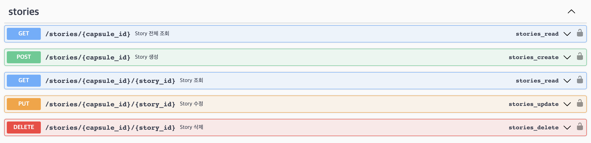
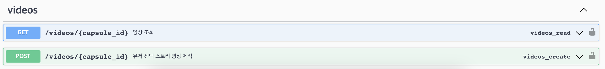

# MemoryCapsule
타임캡슐 생성 후 친구들을 초대해 사진과 이야기를 공유하고, 지정된 날짜에 합쳐진 컨텐츠를 모두에게 전송하는 플랫폼

### System Architecture

 

### Tech Stack
| Area       | Tech Stack                                                                                                                                                                                                                                                                                                                                                                                                                                                                                                                                                                                                                                                                                                                                                                                                                                                                                 |
|------------|--------------------------------------------------------------------------------------------------------------------------------------------------------------------------------------------------------------------------------------------------------------------------------------------------------------------------------------------------------------------------------------------------------------------------------------------------------------------------------------------------------------------------------------------------------------------------------------------------------------------------------------------------------------------------------------------------------------------------------------------------------------------------------------------------------------------------------------------------------------------------------------------|
| Frontend   |                                                                                                                                                                                                                                                                                                                                                                                                                                                      |
| Backend    |                                                                                                                                                                                                                                                   |
| DevOps     |                                                                                                                                                                                                                                                                                                                                    |
| AI         |                                                                                                                                                                                                                                                                                                                                                                                                                                                                                                                                                                                                                                                                                  |
| Monitoring |                                                                                                                                                                                                                      |
| etc        |            |

 

Frontend

내용

 
 

Backend

## API

### user

### capsule

### story

### video

swagger를 사용하여 API 명세서를 작성 하였습니다.

## Asynchronous

비디오 생성 작업은 celery 비동기 처리됩니다. 메세지 브로커는 rabbitmq가 사용됩니다. 

