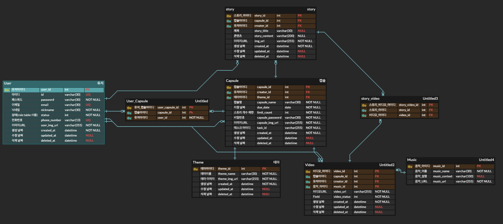
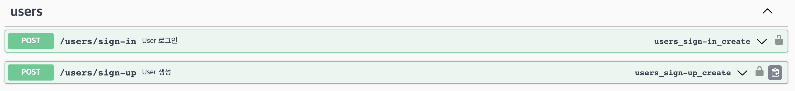
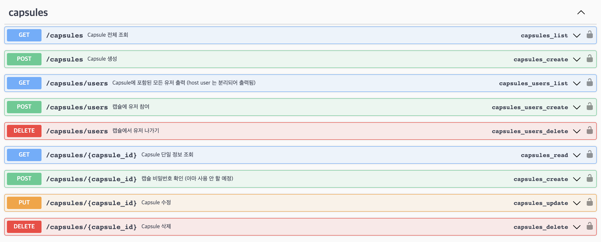

# 💊 MemoryCapsule

타임캡슐 생성 후 친구들을 초대해 사진과 이야기를 공유하고, 지정된 날짜에 합쳐진 컨텐츠를 모두에게 전송하는 플랫폼

Medium:

 

## 💻 System Architecture

 
 

## 💡 Tech Stack

| Area       | Tech Stack                                                                                                                                                                                                                                                                                                                                                                                                                                                                                                                                                                                                                                                                                                                                                                                                                                                                              |
| ---------- | --------------------------------------------------------------------------------------------------------------------------------------------------------------------------------------------------------------------------------------------------------------------------------------------------------------------------------------------------------------------------------------------------------------------------------------------------------------------------------------------------------------------------------------------------------------------------------------------------------------------------------------------------------------------------------------------------------------------------------------------------------------------------------------------------------------------------------------------------------------------------------------- |
| Frontend   |                                                                                                                             |
| Backend    |                                                                                                                                                                                                                                                |
| DevOps     |                                                                                                                                                                                                                                                                                                                                 |
| AI         |                                                                                                                                                                                                                                                                                                                                                                                                                                                                                                                                                                                                                                                                               |
| Monitoring |                                                                                                                                                                                                                   |
| etc        |         |

 
 

## 💽 ERD

 
 

## 📈 API

### user

### capsule

### story

### video

swagger를 사용하여 API 명세서를 작성 하였습니다.

 
 

## 📚 Asynchronous

비디오 생성 작업은 celery 비동기 처리됩니다. 메세지 브로커는 rabbitmq가 사용됩니다.

 
 

## 👨‍👩‍👧‍👦 Team

| Name    | 박경은                                                                   | 김성훈                                                                     | 김윤아                                                                | 정재빈                                                                | 유재윤                                                                    | 이민기                                                                |
| ------- | ------------------------------------------------------------------------ | -------------------------------------------------------------------------- | --------------------------------------------------------------------- | --------------------------------------------------------------------- | ------------------------------------------------------------------------- | --------------------------------------------------------------------- |
| Profile |  |  |  |  |  |  |
| role    | Leader, Frontend,  Backend,  DevOps                          | Frontend                                                                   | Frontend                                                              |
| GitHub  | [@devGEP](https://github.com/devGEP)                                     | [@koreaGorilla](https://github.com/koreaGorilla)                           | [@1-yuna](https://github.com/1-yuna)                                  | [@JaeBin2019](https://github.com/JaeBin2019)                          | [@yoojaeyoonGit](https://github.com/yoojaeyoonGit)                        | [@kiminni](https://github.com/kiminni)                                |
